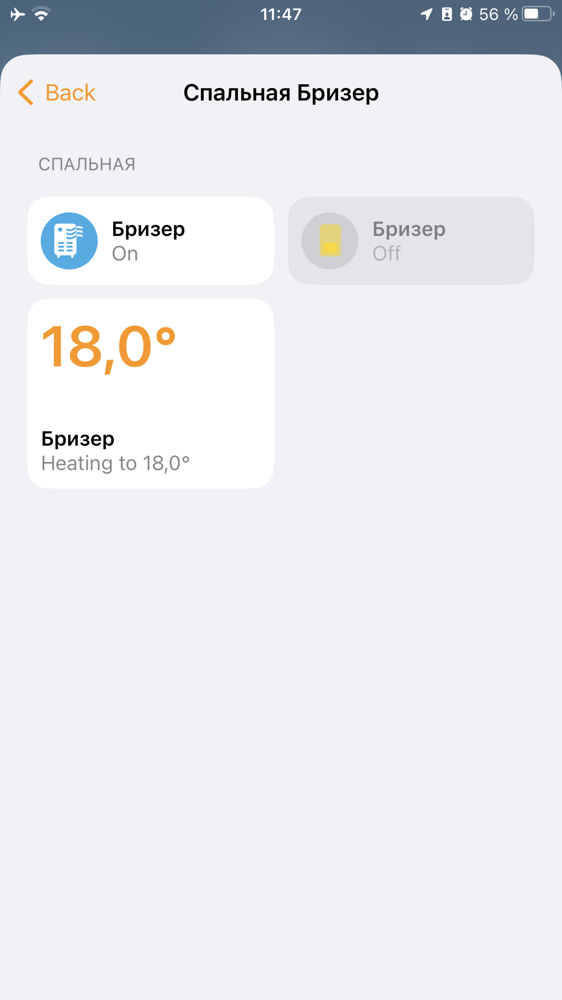

# homebridge-tion

[](https://nodei.co/npm/homebridge-tion/)

[](https://www.npmjs.com/package/homebridge-tion)
[](https://www.npmjs.com/package/homebridge-tion)

Плагин для [Homebridge](https://github.com/nfarina/homebridge), позволяющий управлять климатической техникой [Tion](https://tion.ru/product/magicair/) (базовой станций MagicAir, бризерами 3S и O2).

## Поддерживаемые устройства

| Модель |
|--------|
| [Базовая станция MagicAir](https://tion.ru/product/magicair/) |
| [Бризер Тион 3S](https://tion.ru/product/breezer-tion-3s/) |
| [Бризер Тион O2](https://tion.ru/product/breezer-tion-o2/) |

Для устройств, которых нет в списке, поддержка пока не реализована. Если вы хотите добавить поддержку новых устройства, свяжитесь со мной или предложите pull-request.

## Функции

- управление бризером (вкл/выкл, скорость, нагрев, температура)
- мониторинг состояния фильтра бризера
- мониторинг качества воздуха (уровень CO2, температура, влажность)
- сигнализация превышения допустимого уровня CO2



## Установка

0. Настройте базовую станцию:

   Из [веб-интерфейса](https://magicair.tion.ru) или из приложения для [iOS](https://apps.apple.com/ru/app/magicair/id1111104830) или [Android](https://play.google.com/store/apps/details?id=com.tion.magicair)

1. Если у вас уже есть [Config UI X](https://github.com/oznu/homebridge-config-ui-x), рекомендую устанавливать и конфигурировать плагин с его помощью, а дальнейшие шаги можно пропустить.

   

2. Установите плагин:

    ```shell
    $ npm install -g homebridge-tion --production
    ```

3. Обновите конфигурацию Homebridge:

   Добавьте в секцию `platforms` следующую запись (см. описание полей ниже):

    ```json
    "platforms": [
        {
            "platform": "Tion",
            "name": "Tion",
            "stationName": ИМЯ_БАЗОВОЙ_СТАНЦИИ,
            "userName": ИМЯ_ПОЛЬЗОВАТЕЛЯ_В_MAGICAIR,
            "password": ПАРОЛЬ_В_MAGICAIR
        }
    ]
    ```

4. Перезапустите Homebridge

   

## Конфигурация

| Поле | Тип | Описание | Обязательно поле | Значение по-умолчанию |
|--------|------|-------------|----------|---------------|
| `name` | `string` | Имя плагина в Homebridge | Да | `Tion` |
| `stationName` | `string` | Если у вас одна базовая станция, оставьте это поле пустым. Если у вас несколько базовых станций, укажите имя _дома_ в MagicAir, где установлена станция | Нет |  |
| `userName` | `string` | Имя пользователя в MagicAir | Да |  |
| `password` | `string` | Пароль в MagicAir | Да |  |
| `co2Threshold` | `number` | Уровень CO2, выше которого будет сигнализировать датчик CO2 в Homekit | Нет | `800` |

## Todo

- [ ] связь с базовой станцией напрямую (локальный режим)
- [ ] поддержка модуля CO2+ и ИК-модуля

## Disclaimer

> Плагин не является заменой официального приложения MagicAir. 

> Я не имею никакого отношения к компании Tion.

> Мне просто нравится климатическая техника Tion и хочется качественного UX с моими устройствами Apple.

## Автор

Илья Рузаков

[t.me/break-pointer](https://t.me/break-pointer)